# TidyScreen


TidyScreen is a package containing a network of Python function aimed to design, structure and execute complex virtual screening campaigns of drugs and bioactive molecules. 

In order to execute de functions actions, several depencies are required, which can be automatically installed using the _CCAD.yml_ conda enviroment file.

**Basic usage:**

After cloning the project, you may explore the network of functions available to design a screening campaign. The following shows an example of the functions available at the moment of creating this README.md file:

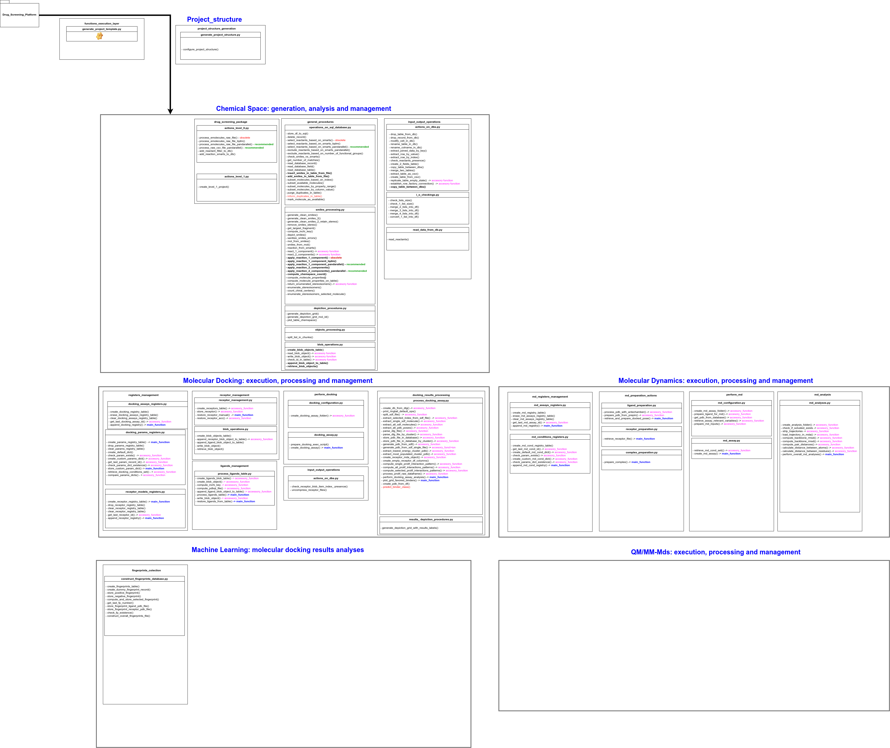

In order to view an interactive version of the network, open the file _platform_diagram.drawio.drawio_ with [Drawio](https://app.diagrams.net/).

For the creation of new a screening project, the following should be executed:

```bash
$ conda activate CCAD_platform  # The conda environment should have been previously created

$ cd functions_execution_layer

$ python generate_project_template.py

# You will be prompted to provide a general project name

$ Enter the name of the general project:

# After giving the project a name, the full path to the location in which the project is to be stored is required. Be sure to have plenty of disk space available in this location, since all results associated to the project will be stored there

$ Enter the project base folder (full path):
```
Once you have accomplished the above mentioned steps, a full project structure will be created as shown in the figure below:

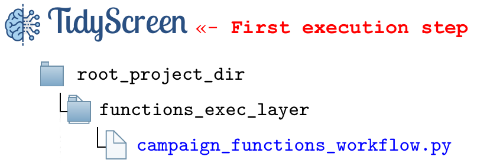

---
**Description of project layers and folders**
---

The *'__root_project_dir__'* &nbsp; folder will correspond to the name of the project you provided. Inside that folder, you will find the first project layers:

- *'__functions_exec_layer__'*&nbsp;: inside this folder, a Python script named after the provided project name (_'project_name.py'_) will be found. This script is the place in which you should sequentially insert the provided TidyScreen functions in order to construct a screening workflow.

The **first time** a project is created, the _'project_name.py'_ Python script should be executed in order to create the overall project folder structure, in which all the corresponding results are to be stored. Upon execution, the folders structure is as shown in the figure below:

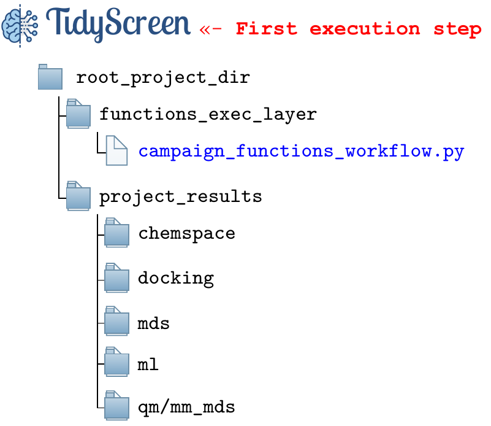


Within the _project_results_ folder, the following subdirs were created for the following purposes:

- **_./chemspace_**: will store all results of the screening project associated to actions towards storing of chemical reactants, custom reactions enumerations, reactants and molecules filters, etc, will be stored. In summary, all the data corresponding the the chemical space generation and analysis.

- **_./docking_**: All results having to do with the execution of molecular docking assays, including the storage of corresponding receptors.

- **_./mds_**: All results having to do with the execution of molecular dynamics simulations.

- **_./ml_**: Data related to the use of machine learning classification models aimed to bioactive pose detection. **Under development**.

- **_./qm/mm_mds_**: Data related to the execution of hybrid quantum/classic molecular dynamics simulations. **Under development**.


Once the project structure has been created and the corresponding environment variables definied within the main execution script (_'project_name.py'_). It is time to start creating screening actions.


---
Editing the _'project_name.py'_ file to configure actions
---

Usually, a first step in a screening campaign is to study a training set of molecules in order to (hopefully) reproduce a crystallographic structure of the protein target under study. In this example, we will attemp to perform a simple docking assay in order to reproduce the crystallographic structure deposited under the PDB code: [2OZ2](https://www.rcsb.org/structure/2OZ2).

The ligand crystallyzed to the protein Cruzipain is known as K777, a well know covalent inhibitor of this protein considered to be an antichagasic therapeutic target. Molecules can be introduced to the TidyScreen processing workflow using the corresponding [SMILES](https://es.wikipedia.org/wiki/SMILES) notation . 

In order to ingest one (or millions) molecule into a database as managed by TidyScreen, it is enough to prepare a .csv files as the one provided in the examples folder (_../examples/chemspace_data/K777.csv_) and place it under the folder: _../${project_name}/{project_name}_project_results/chemspace/raw_data__

Once the .csv file has been copied to the correponding folder, the following function call can be added to the _'project_name.py'_ file:

```
## STEP 1: A custom csv file containing ligands in the SMILES format is read into a custom database and custom table.
#help(acts_level_0.process_raw_csv_file_pandarallel)
source_filename = f'{raw_data_path}/K777.csv'
destination_db = f'{main_db_output_path}/CZP_binders.db'
destination_table = source_filename.split('/')[-1].replace('.csv','')
retain_stereo = 0
acts_level_0.process_raw_csv_file_pandarallel(source_filename,destination_db,destination_table,retain_stereo)
```

Please check the _help()_ on the fucntion in oder to inspect available parameters (such as delete existing stereochemistry definitions).

As can be seen in the code, the .csv file will be processed and and the destination database (_CZP_binders.db_) will be created under the _project_results/chemspace/processed_data_ folder. The corresponding SQL database can be opened as preferred. We use [DB Browser for SQLite](https://sqlitebrowser.org/).

The figure below shows table and register created:

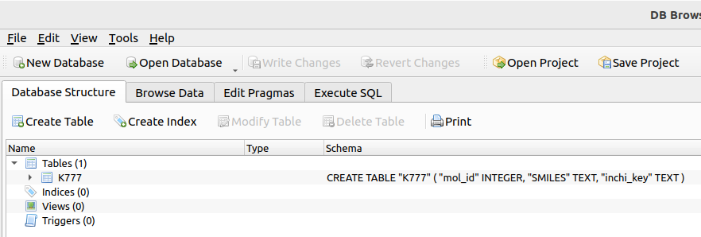

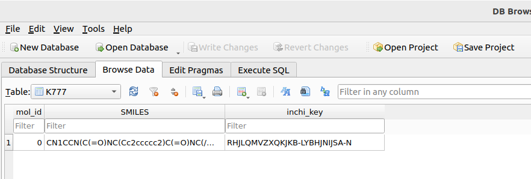

As can be seen, the molecule is stored with the corresponding SMILES notation and a unique inchi_key value. This last value has been generated to identify the molecule among similar species, such as stereoisomers.

In addition, stereoisomer enumeration may be desirable in case we are dealing with a stereoselective target. In that case, we can append the following function to the workflow:

```
## STEP 2: This will enumerate all stereoisomers within a table.
#help(smiles_processing.enumerate_stereoisomers)
db_name = f'{main_db_output_path}/CZP_binders.db'
table_name = "K777"
smiles_processing.enumerate_stereoisomers(db_name,table_name)

```

Check how the corresponding _#_stereo_enum_ table has been created within the database:

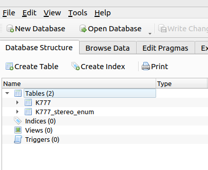

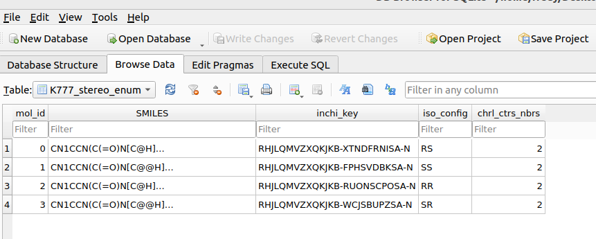

Check how K777 has been enumerated, with each stereoisomer now stored in an unique record. (If required, a single one can be subseted using the corresponding function). In the case of K777, it is already known that the _S,S_ stereoisomer is the bioactive one, let subset is:

```
## STEP 3: Separate the ligands mantaining the S,S stereo
#help(db_ops.subset_molecules_by_column_value)
db_name = f'{main_db_output_path}/CZP_binders.db'
origin_table = "K777_stereo_enum"
dest_table = "K777_stereo_enum_SS"
column_name = "iso_config"
value = "SS"
action = "append"
db_ops.subset_molecules_by_column_value(db_name,origin_table,dest_table,column_name,value,action)

```

The corresponding table containing the indicated stereoisomer has been created.

We shall also depipt the molecules stored within a certain table. Lets check the stereoisomers generated for K777. The following function is used:

```
## STEP 4: after a subseting of reactants is performed, it is useful to depict their structures.
#help(depic.generate_depiction_grid)
source_db = f'{main_db_output_path}/CZP_binders.db'
table_name = "K777_stereo_enum"
images_dest_dir =  f'{miscellaneous_files}/{table_name}'
max_mols_ppage = 25
depic.generate_depiction_grid_mol_id(source_db,table_name,images_dest_dir,max_mols_ppage)
```

One (or more) .png file/s depicting the molecules present in the table will be generated under the folder _project_results/chemspace/misc_

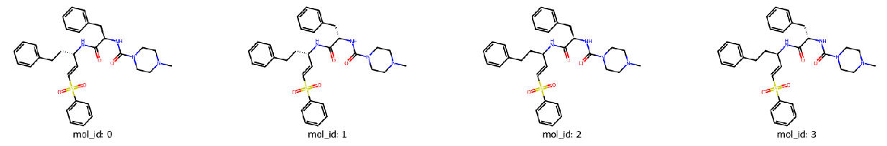

---
Preparing a docking assay
---

### Ligands preparation

Once molecules are stored within a table, the preparation for molecular docking assays is straightforward.

TidyScreen has been prepared to work in conjunction with [AutoDock-GPU](https://github.com/ccsb-scripps/AutoDock-GPU), which has been developed by the [ForliLab](https://forlilab.org/) at Scripps Research. We acknowledge Stefano Forli, Diogo Santos-Martins and Andreas Tillack for the kind feedback during TidyScreen development.

The first step to perform a docking assay with AutoDock-GPU is to prepare the corresponding _.pdbqt_ files for the ligands. 

In order to prepare .pdbqt ligands, TidyScreen uses [Meeko](https://github.com/forlilab/Meeko) a package developed at [ForliLab](https://forlilab.org/) and which has many customizing options that are very useful in diverse screening scenarios. We again acknowledge [Diogo Santos-Martins](https://forlilab.org/members/) for the support during this implementation process.

Preparation of the ligands .pdbqt files can be accomplised on the whole table using the corresponding function:

```
# STEP 5: Generate the .pdqbt files for docking purposes.
#help(proc_ligs.process_ligands_table)
origin_db = f'{main_db_output_path}/CZP_binders.db'
table_name = "K777_stereo_enum"
dest_db = f'{main_db_output_path}/CZP_binders.db'
write_conformers = 0 # If activated ==1 - will write all conformers searched for ligand .pdbqt generation
conformer_rank = 0 # The rank of the conformer in the search to be used as ligand. 0-based index (0 is the lowest energy conformer)
proc_ligs.process_ligands_table(origin_db, table_name,dest_db,conformer_rank,write_conformers)

``` 

Once the function is run, a new table within the database is created:

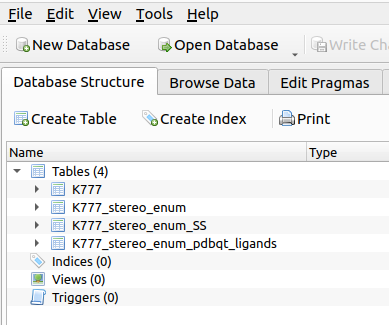

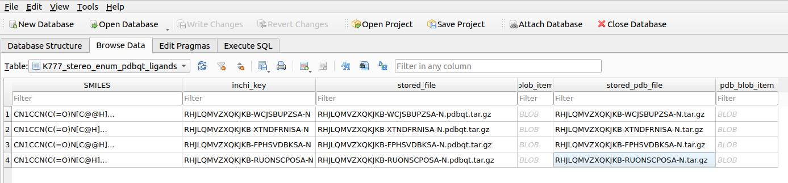

As can be seen, both the .pdbqt file and .pdb (with atom numbering consistant with the corresponding .pdbqt file) are stored within the database. This table is now ready to be subjected to molecular docking studies.

### Receptor preparation

Usually in molecular docking studies, diffente types (or versions) or target receptor are used. In this way, it is usefull to organize receptor models within a receptor registry table. Consequently, when managing receptors with TidyScreen, the first step is to create a receptor registry table as follows:

```
# STEP 6: Creation of the receptor registry table to store all receptor models.
#help(rec_regs.create_receptor_registry_table)
rec_regs.create_receptor_registry_table(receptor_models_registry_path)

```

Once this function is executed, the following database is created: _project_results/docking/receptor_models_registers/receptors_models_registry.db_

The database created contains a table named '_receptor_models_', with the following fields:

- _receptor_model_id_: a number that will be used to indicate the receptor model when requesting the preparation of a docking assay.
- _pdb_identifier_: full path to the .pdb file originating the receptor model prepared for docking assays using AutoDock-GPU.
- _receptor_object_: contains a BLOB oject within the SQL database corresponding to a compressed file corresponding to the PDBQT files of the receptor, grid maps and all associated files required to execute the docking.
- _description_: a short comment respect to the receptor model features.
- _pdb_file_: name of the .pdb file originating the receptor.

As mentioned above, the molecular docking assays managed by TidyScreen are prepared to use AutodoDock-GPU as docking engine. Consequently, all the actions required to prepare the receptor for docking (receptor refinement, grid calculations, grid refinements, etc) should be done in an separate folder, which is aftewards used by TidyScreen for storage and preparing docking assays. An example of the prepared receptor corresponding to [2OZ2](https://www.rcsb.org/structure/2OZ2) is provided in the examples folder within the repository. The whole folder need to be copied within the TidyScreen project folders under: _project_results/docking/raw_data_ . Afterwards, the following function is invoked in the workflow designed in _'project_name.py'_:

```
# STEP 7: adding the receptor model files to the registry database. The models are read by folder name from 'docking_raw_data_path'
#help(rec_regs.append_receptor_registry)
rec_folder = f'{docking_raw_data_path}/2OZ2'
rec_regs.append_receptor_registry(receptor_models_registry_path,rec_folder)
```

After execution, the receptor model has been stored within _project_results/docking/receptor_models_registers/receptors_models_registry.db_:

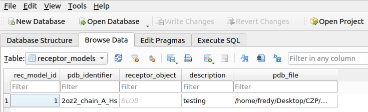

The next step is to create a database aimed to store different molecular docking conditions which will be saved under a unique condition number. The database created is located in _project_results/docking/docking_params_registers/docking_parameters.db_ and only created once in a project: 


```
# STEP 8: Create of docking parameters registry table.
#help(reg_dock_parm.create_params_registry_table)
reg_dock_parm.create_params_registry_table(docking_params_registry_path)
```

Next, a set of AutoDock-GPU docking parameters is created and stored as a Python dictionary within the corresponding database. All parameters can be modified indicating the corresponding parameter name. Lets create a default docking set of conditions by typing 'DONE' when requested by the following function:

```
# STEP 9: Create a custom docking parameters condition to be applied
#help(reg_dock_parm.store_custom_param_dict)
reg_dock_parm.store_custom_param_dict(docking_params_registry_path)

```
The set of docking parameters has been created and stored within the database:

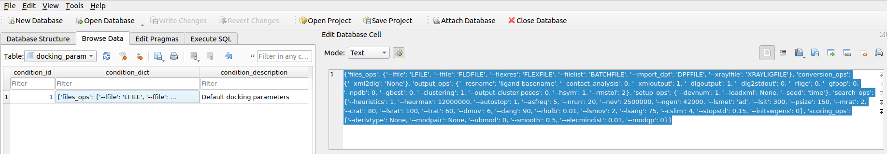

In a next step, a docking assays registry database needs to be created only once in a project. This database is stored in _project_results/docking/docking_assays_registers/docking_registries.db_. The function to execute is:

```
#STEP 10: Create a docking assays registry table
#help(reg_dock_ass.create_docking_registry_table)
reg_dock_ass.create_docking_registry_table(docking_assays_registry_path)
```

Based on all the above generated information, it is now time to configure a docking assay using the following function call:

```
# STEP 11: Configuration of a docking assay
#help(dock_ass.create_docking_assay)
ligands_db = "CZP_binders.db"
ligands_table_name = 'K777_stereo_enum_pdbqt_ligands'
rec_model_id = 1
docking_params_id = 1
hpc_assay_path = "/$PATH/TO/STORE/IN/HPC"
n_chunk = 10000
dock_ass.create_docking_assay(receptor_models_registry_path,docking_assays_registry_path,docking_params_registry_path,docking_assays_storing_path,f'{main_db_output_path}/{ligands_db}',ligands_table_name,rec_model_id,docking_params_id,hpc_assay_path,n_chunk)
```

After the function is executed, a new docking assay is created under the folder: _project_results/docking/docking_assays/docking_assay_1_. A bash script named: _docking_execution_1.sh_ is placed within that folder. Its execution will use a local GPU (if avalable) to sequentially run all dockings of every ligand in the input table (in this example 4 stereoisomers of K777 were docked).


---
Docking results analysis
---
Documentation in preparation

---
Performing selected molecular dynamics simulations
---
Documentation in preparation

---
Detecting bioactive binding poses using ML
---
Documentation in preparation